# ML Project Usage

This README lists the exact commands to run each step of the pipeline for **all datasets** using the `ml_controller` node.

## Prerequisites

```bash
# Build and source your workspace
colcon build --packages-select ml_project
source install/setup.bash
```

## Launch the Controller

Run the controller in one terminal:

```bash
ros2 run ml_project ml_controller
```

## Commands for Each Dataset

Use a second terminal to publish each command:

### Fruits Dataset (Linear Classifier)

```bash
ros2 topic pub /ml_command std_msgs/String "{data: '/load fruits'}" --once
ros2 topic pub /ml_command std_msgs/String "{data: '/visualise fruits'}" --once
ros2 topic pub /ml_command std_msgs/String "{data: '/train fruits'}" --once
ros2 topic pub /ml_command std_msgs/String "{data: '/eval fruits'}" --once
ros2 topic pub /ml_command std_msgs/String "{data: '/importance fruits'}" --once
```

### Iris Dataset (KNN, Decision Tree, Random Forest)

```bash
ros2 topic pub /ml_command std_msgs/String "{data: '/load iris'}" --once
ros2 topic pub /ml_command std_msgs/String "{data: '/visualise iris'}" --once

# Train & evaluate KNN
ros2 topic pub /ml_command std_msgs/String "{data: '/train iris knn'}" --once
ros2 topic pub /ml_command std_msgs/String "{data: '/eval iris knn'}" --once
ros2 topic pub /ml_command std_msgs/String "{data: '/importance iris knn'}" --once

# Train & evaluate Decision Tree
ros2 topic pub /ml_command std_msgs/String "{data: '/train iris decision_tree'}" --once
ros2 topic pub /ml_command std_msgs/String "{data: '/eval iris decision_tree'}" --once
ros2 topic pub /ml_command std_msgs/String "{data: '/importance iris decision_tree'}" --once

# Train & evaluate Random Forest
ros2 topic pub /ml_command std_msgs/String "{data: '/train iris random_forest'}" --once
ros2 topic pub /ml_command std_msgs/String "{data: '/eval iris random_forest'}" --once
ros2 topic pub /ml_command std_msgs/String "{data: '/importance iris random_forest'}" --once
```

### Cancer & Penguin Datasets (Linear SVM)

```bash
ros2 topic pub /ml_command std_msgs/String "{data: '/load cancer_penguin'}" --once
ros2 topic pub /ml_command std_msgs/String "{data: '/visualise cancer_penguin'}" --once
ros2 topic pub /ml_command std_msgs/String "{data: '/train cancer_penguin'}" --once
ros2 topic pub /ml_command std_msgs/String "{data: '/eval cancer_penguin'}" --once
ros2 topic pub /ml_command std_msgs/String "{data: '/importance cancer_penguin'}" --once
```

## Notes

* **Wait** a few seconds between commands for processing & plot saving.  
* All generated plots are saved under `install/share/ml_project/data_processed/<dataset>/`.  

---

## Findings Summary

**Fruits (Linear Classifier)**  
Fruit weights and sphericity separate apples and oranges well. Model accuracy is high (93%). One apple was misclassified as orange. Mid-range weights are harder to classify than extremes.

**Iris (KNN)**  
KNN achieved perfect classification on the test set. All three species were identified correctly. No errors occurred, showing clear clusters in feature space.

**Iris (Decision Tree)**  
Decision tree predicted every sample correctly. All species have precision and recall of 1.00. The tree captured the simple decision boundaries in data.

**Iris (Random Forest)**  
Random forest also gave perfect accuracy. Every species was classified without mistake. The ensemble of trees handled any leftover variance.

**Cancer & Penguin (Linear SVM)**  
Breast cancer classifier reached 95% accuracy. A few malignant cases were misidentified, so recall is slightly lower. Penguin classifier reached 99% accuracy. Only one Chinstrap was misclassified.


---

## Detailed Report

### Fruit Dataset (Logistic Regression)

**Feature Engineering**  
- Loaded `fruits_weight_sphercity.csv` with mean-imputation for numeric features and one-hot encoding for `Color`.  
- Standard-scaled `Weight` and `Sphericity`.  

**Data Visualization**  
- Scatter plot: Weight vs Sphericity  
- Histograms: Weight distribution, Sphericity distribution  
- Bar charts: Color distribution, Label counts  

**Model Evaluation**  
- Confusion matrix, classification report, actual vs predicted counts, weight distribution for correct vs incorrect.  

**Feature Importances**  
- Horizontal bar chart of logistic regression coefficients.  

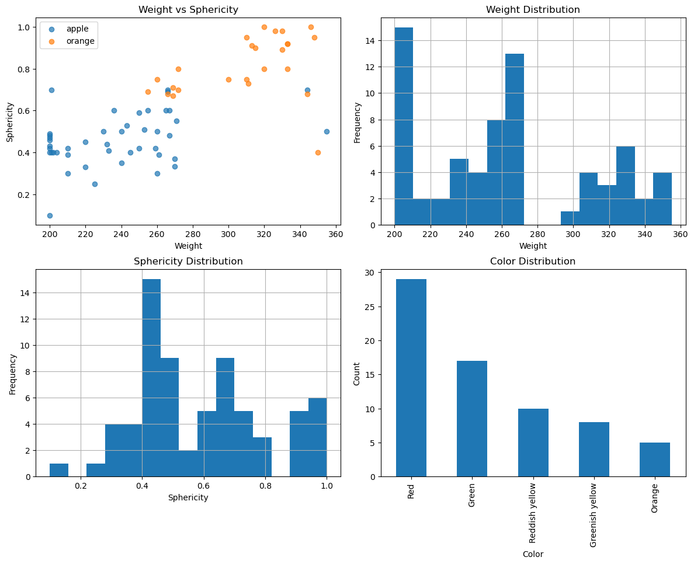  
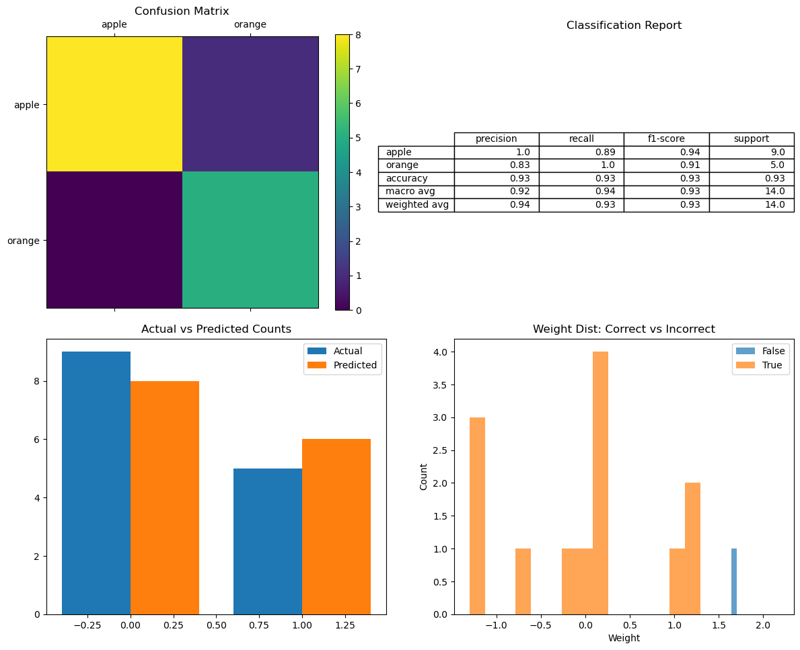  
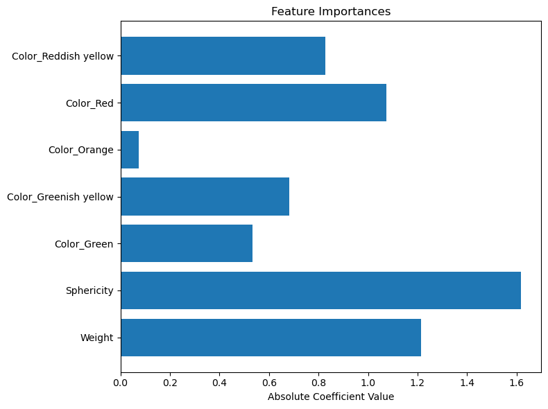  

### Iris Dataset (KNN, Decision Tree, Random Forest)

**Feature Engineering**  
- Loaded `Iris.csv` with mean-imputation and standard scaling of all numeric features.  

**Data Visualization**  
- Scatter plots: sepal length vs sepal width, petal length vs petal width  
- Histograms: feature distributions and species counts  

**Model Evaluation**  
- For each model (KNN, Decision Tree, Random Forest): confusion matrix, classification report, actual vs predicted counts, correct vs incorrect count.  

**Feature Importances**  
- Permutation importance for KNN, built-in `feature_importances_` for tree models.  

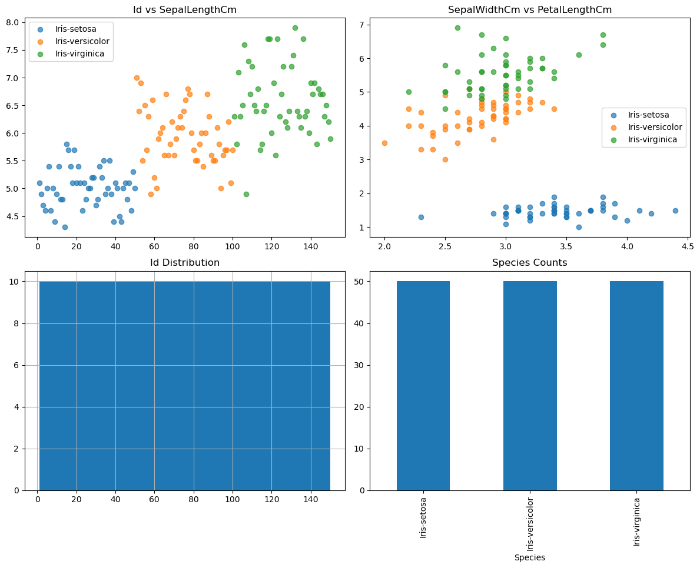  
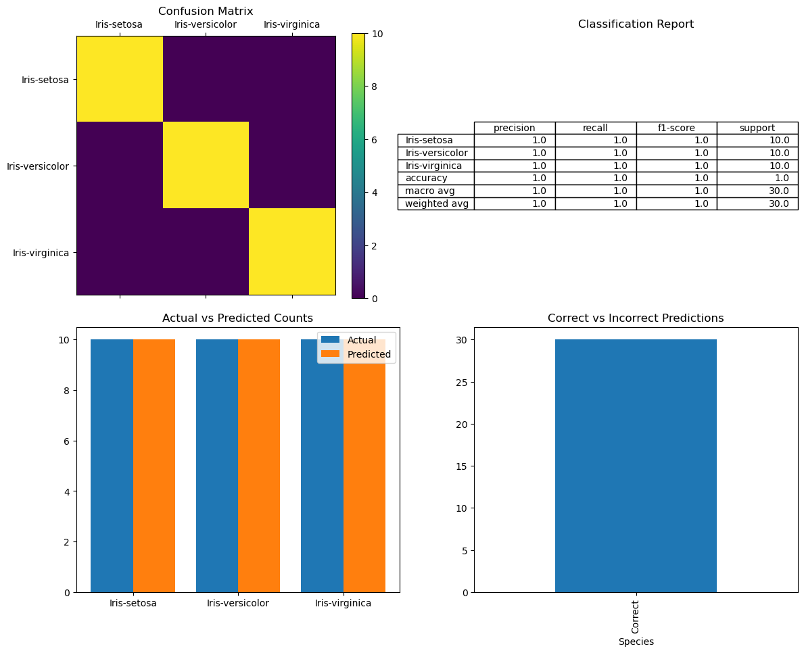  
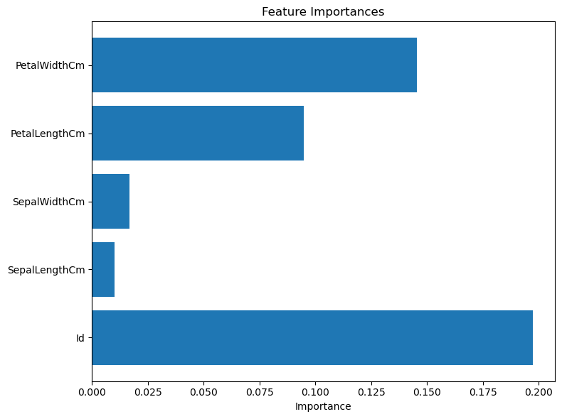  
  
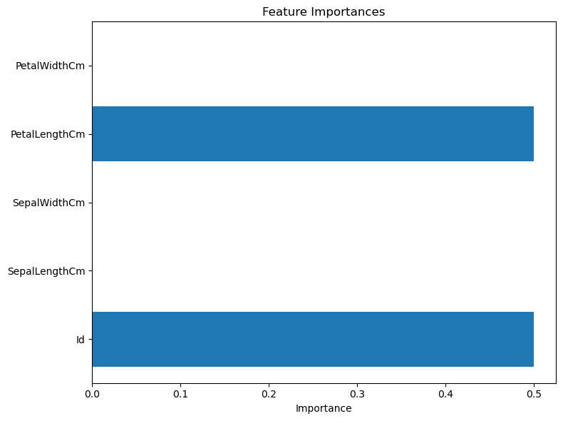  
  
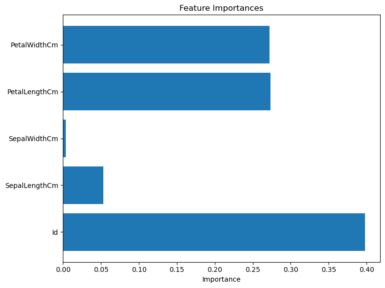  

### Breast Cancer & Penguin Datasets (Linear SVM)

**Feature Engineering**  
- Mean-imputation and standard scaling of numeric features for cancer and penguin datasets.  
- One-hot encoding of categorical features in penguin data.  

**Data Visualization**  
- 2×3 grid: scatter plots, histograms, and label counts for both diagnoses and species.  

**Model Evaluation**  
- Confusion matrix, classification report, and actual vs predicted counts for both SVM models.  

**Feature Importances**  
- Horizontal bar charts of SVM coefficient magnitudes for both datasets.  

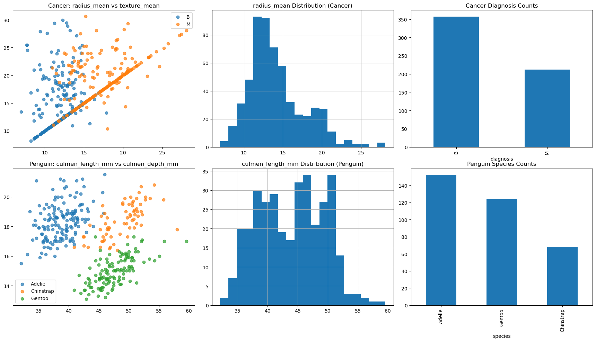  
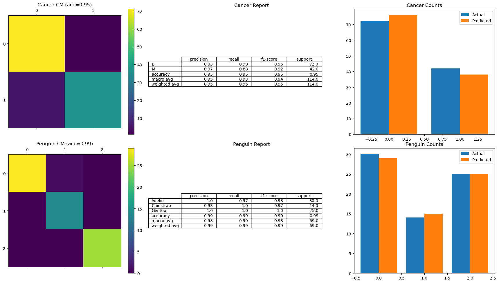  
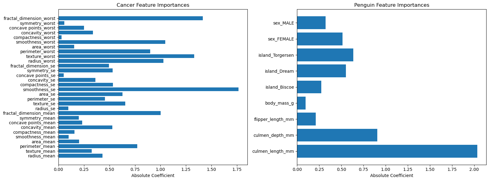  

**Credits**

Project created by: Veronica Kwok

This project was created at the University of Europe for Applied Sciences Potsdam. 

Supervised by: Dr. Aditya Mushyam 

Subject: Vehicular Technology, Software Optimization (Summer Semester 2025)